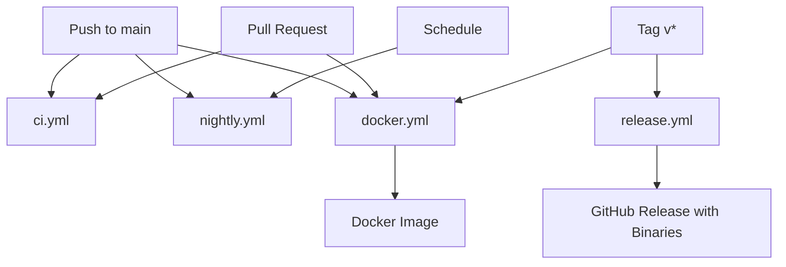

# GitHub Actions Workflows

This directory contains all CI/CD workflows for the iq-to-audio project.

## Workflow Overview

### 🔄 Continuous Integration

#### [`ci.yml`](./ci.yml)
- **Triggers**: Push to main, Pull requests
- **Purpose**: Main CI pipeline for testing and validation
- **Actions**:
  - Runs tests across Linux, Windows, macOS
  - Linting with ruff
  - Type checking with mypy
  - Coverage reporting to Codecov
  - Performance benchmarks (main branch only)
  - PyInstaller smoke tests

### 🌙 Nightly Builds

#### [`nightly.yml`](./nightly.yml)
- **Triggers**: Push to main, Daily at 2 AM UTC, Manual
- **Purpose**: Development builds for testing latest changes
- **Actions**:
  - Builds PyInstaller binaries for all platforms
  - Creates/updates nightly pre-release on GitHub
  - Uploads artifacts for manual testing

### 📦 Release Management

#### [`release.yml`](./release.yml)
- **Triggers**: Version tags (v*), Manual with tag input
- **Purpose**: Official release builds with all binaries
- **Actions**:
  - Builds PyInstaller binaries for all platforms:
    - Linux (x86_64, arm64)
    - Windows (amd64, arm64)
    - macOS (Intel x86_64, Apple Silicon arm64)
  - Code signing and notarization for macOS
  - Creates GitHub release with checksums
  - Triggers Docker build if needed

#### [`docker.yml`](./docker.yml)
- **Triggers**: Push to main, Version tags, Pull requests
- **Purpose**: Docker image building and publishing
- **Actions**:
  - Multi-platform builds (amd64, arm64)
  - Publishes to GitHub Container Registry
  - Vulnerability scanning with Trivy
  - SBOM generation

### 🔧 Maintenance

#### [`dependabot.yml`](../.github/dependabot.yml)
- **Schedule**: Weekly on Mondays
- **Purpose**: Automated dependency updates
- **Monitors**:
  - Python dependencies (pip)
  - GitHub Actions versions
  - Docker base images

## Workflow Dependencies



## Environment Secrets Required

### For Release Builds
- `MACOS_CODESIGN_CERT_BASE64` - Base64 encoded p12 certificate
- `MACOS_CODESIGN_CERT_PASSWORD` - Certificate password
- `MACOS_CODESIGN_IDENTITY` - Signing identity (e.g., "Developer ID Application: ...")
- `MACOS_NOTARIZE_USER` - Apple ID for notarization
- `MACOS_NOTARIZE_PASSWORD` - App-specific password
- `MACOS_NOTARIZE_TEAM_ID` - Apple Developer Team ID

### For CI/Testing
- `CODECOV_TOKEN` - Codecov token (optional but recommended)

### Automatic (provided by GitHub)
- `GITHUB_TOKEN` - Automatically provided for GitHub operations
- `GITHUB_ACTOR` - User triggering the workflow

## Platform Support Matrix

| Platform | Architecture | CI Tests | Nightly | Release | Docker |
|----------|-------------|----------|---------|---------|---------|
| Linux | x86_64 | ✅ | ✅ | ✅ | ✅ |
| Linux | arm64 | ❌ | ✅ | ✅ | ✅ |
| macOS | x86_64 | ❌ | ❌ | ✅ | ❌ |
| macOS | arm64 | ✅ | ✅ | ✅ | ❌ |
| Windows | amd64 | ✅ | ✅ | ✅ | ❌ |
| Windows | arm64 | ❌ | ✅ | ✅ | ❌ |

## Workflow Triggers Summary

| Event | Workflows Triggered |
|-------|-------------------|
| Push to main | ci, nightly, docker |
| Pull request | ci, docker |
| Tag push (v*) | release, docker |
| Schedule | nightly (daily at 2 AM UTC) |
| Manual | All workflows support workflow_dispatch |

## Local Testing

To test workflows locally, you can use [act](https://github.com/nektos/act):

```bash
# Test CI workflow
act push -W .github/workflows/ci.yml

# Test with specific event
act pull_request -W .github/workflows/ci.yml

# Test with secrets
act push -W .github/workflows/release.yml -s GITHUB_TOKEN="..."
```

## Maintenance Notes

1. **Cache Management**: All workflows use UV cache to speed up builds. Caches are keyed by OS, architecture, and pyproject.toml hash.

2. **Artifact Retention**:
   - Nightly builds: 7 days
   - Release artifacts: 90 days (GitHub default)
   - Failed build logs: 30 days

3. **Concurrency Control**: CI workflow cancels in-progress runs when new commits are pushed to the same PR/branch.

4. **Testing Requirements**: CI requires 70% code coverage minimum. This can be adjusted in pyproject.toml.

5. **Build Matrix**: CI tests on Python 3.13 only (as per project requirements). Add more versions to the matrix if needed.